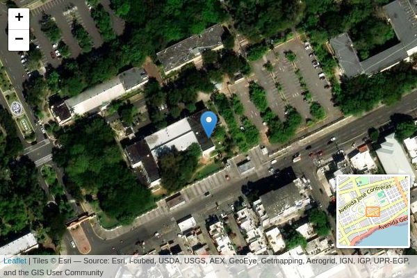

Curso introductorio a los Sistemas de Información Geográfica (SIG)
================
José Martínez

Versión HTML (más legible e interactiva),
[aquí](https://geofis.github.io/curso-sig-doctorado-2024-verano/README.html)

# Presentaciones de diapositivas incluidas en este repo:

- [Introducción a los SIG y herramientas de
  programación](https://geofis.github.io/curso-sig-doctorado-2024-verano/media/intro-sig-herramientas-programacion.html)

- [Puntos de muestreo, herramientas de
  programación](https://geofis.github.io/curso-sig-doctorado-2024-verano/media/puntos-de-muestreo-herramientas-programacion.html)

- [Fuentes de imágenes satelitales orientado al análisis de uso de
  suelo](https://geofis.github.io/curso-sig-doctorado-2024-verano/media/fuentes-imagenes-satelitales-uso-suelo.html)

# Fecha

- Días: 1 al 4 de julio, 2024
- Horario: 2 a 4.30 pm
- Lugar: aula FC-101

<figure>

<figcaption aria-hidden="true">Mapa</figcaption>
</figure>

# Programa

## Día 1: Introducción a los SIG y herramientas de programación

### Primera sesión (1 hora)

- Introducción a los Sistemas de Información Geográfica (SIG)
- Historia y evolución de los SIG
- Aplicaciones de los SIG en diversas disciplinas
- Ejercicio práctico:
  - Interfaz gráfica de QGIS
  - Cargar una fuente ráster
  - Cargar una fuente vectorial

### Segunda sesión (1.5 horas)

- Introducción a R y RStudio (cuaderno RMarkdown)
- Introducción a Python y Jupyter (cuaderno Jupyter)
- Ejercicio práctico:
  - Iniciar en la cuenta del servidor RStudio
  - Configuración de cuadernos reproducibles
  - Cuaderno reproducible
  - [Tutorial 1](https://geofis.shinyapps.io/tutorial1/)

## Día 2: Puntos de muestreo

### Primera sesión (1 hora)

- Conceptos y técnicas para la creación de puntos de muestreo
- Herramientas para la visualización de puntos de muestreo

### Segunda sesión (1.5 horas)

- Ejercicio práctico: Creación y visualización de puntos de muestreo
- Discusión y análisis de resultados

## Día 3: Fuentes de imágenes satelitales orientado al análisis de uso de suelo

### Primera sesión (1 hora)

- Introducción a las imágenes satelitales
- Proveedores y tipos de imágenes satelitales

### Segunda sesión (1.5 horas)

- Técnicas de interpretación de imágenes satelitales
- Ejercicio práctico: Uso de Google Earth Engine para análisis de uso de
  suelo

## Día 4: Mapeo de áreas de sensibilidad ambiental y conclusiones

### Primera sesión (1 hora)

- Identificación y mapeo de áreas de sensibilidad ambiental
- Herramientas y técnicas de análisis espacial

### Segunda sesión (1.5 horas)

- Ejercicio práctico: análisis estadísticos y mapeo de áreas de
  sensibilidad ambiental con R y RStudio
- Discusión y retroalimentación
- ¿Para qué podrían usarse los servicios opcionales (ver abajo)?
- Conclusiones y próximos pasos en el aprendizaje de SIG

## Recursos y Herramientas

- **Software:**
  - Para instalar: QGIS (versión 3.x).
  - Provistos por mí, pero adelante si los quieres instalar: R en
    RStudio y Python en cuadernos Jupyter.
- **Servicios:**
  - Google Earth Engine, casi imprescindible.
  - ChatGPT
  - (opcional) Copernicus Data Space Ecosystem o Sentinel Hub
  - (opcional) Google Colab
  - (opcional) GitHub
  - (opcional) Overleaf. Obtén una cuenta en Overleaf para crear
    documentos avanzados
  - (opcional) Zotero Desktop y cuenta en Zotero. Te podría ayudar a
    manejar citas y referencias. Existen otros servicios, como Scite y
    CiteDrive
- **Datos:** Imágenes satelitales (por ejemplo, Landsat, Sentinel),
  bases de datos geográficos disponibles públicamente. Orientaré dónde
  obtener estas fuentes, pero últimamente recomiendo apuntar primero al
  Google Earth Engine.
- **Lecturas:** Las que deseen traer; son bienvenidos artículos
  introductorios y tutoriales en línea sobre QGIS, R y Python para
  geociencias, y Google Earth Engine.

# Referencias destacadas

Bivand, R. S., Pebesma, E., & Gómez-Rubio, V. (2013). Applied Spatial
Data Analysis with R. Springer New York.
<https://doi.org/10.1007/978-1-4614-7618-4>

Olaya, V. (2020). Sistemas de Información Geográfica.
<https://volaya.github.io/libro-sig/>

Lovelace, R., Nowosad, J., & Muenchow, J. (2019). Geocomputation with R.
Chapman and Hall/CRC. <https://r.geocompx.org/>

Dorman, M., Graser A., Nowosad, J. & Lovelace, R. (2019). Geocomputation
with Python. Chapman and Hall/CRC. <https://py.geocompx.org/>
