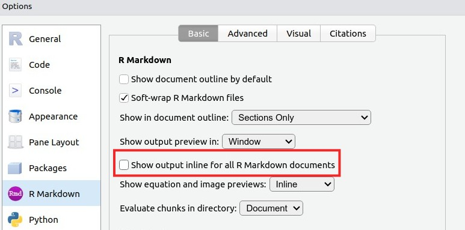

```{r setup, include=FALSE}
options(htmltools.dir.version = FALSE)
```

class: center, middle
background-image: url(img/fondo.jpg)

# Fuentes de imágenes satelitales orientado al análisis de uso de suelo
## Curso introductorio a los Sistemas de Información Geográfica (SIG)
### *José Martínez*
### Universidad Autónoma de Santo Domingo (UASD)
#### 2024-07-03 y 2024-07-04


---

# Cuando te toque...

## Pide ayuda al ChatGPT

Desde la siguiente diapositiva en adelante, verás varios ejercicios de aula. Este es un buen momento para que uses el ChatGPT. Pregúntale cómo hacerlo. Para interactuar con dicha herramienta en el contexto de nuestro tema, te recomiendo lo siguiente:

- Concisión. 

- Agilidad. No pierdas tiempo intentando conseguir la mejor ortografía ni la mejor redacción. Las palabras clave, y un "cierto orden", son más importantes. 

- Precisión en lo que se pregunta.

- Mejor dar órdenes.

- Truco: pídele que te documente código informático, que te lo explique.

---


# ¿Dónde encontrar fuentes satelitales (y otras)?

- Busca primero en el catálogo de Google Earth Engine: https://earthengine.google.com/
- Copernicus Data Space Ecosystem, Copernicus Browser: https://dataspace.copernicus.eu
- Sentinel Hub: https://www.sentinel-hub.com/
- USGS Earth Explorer: https://earthexplorer.usgs.gov/
- NASA Earthdata: https://earthdata.nasa.gov/
- Alaska Satellite Facility Vertex: https://vertex.daac.asf.alaska.edu/
- Planet Labs: https://www.planet.com/
- LandsatLook Viewer: https://landsatlook.usgs.gov/
- JAXA G-Portal (Japan Aerospace Exploration Agency): https://gportal.jaxa.jp/gpr/

---

# ¿Dónde encontrar fuentes satelitales (y otros tipos de datos)?

- Maxar: https://www.maxar.com/
- Copernicus Open Access Hub (está programado para retiro): https://scihub.copernicus.eu/
- OpenAerialMap: https://openaerialmap.org/
- TerraSAR-X/TanDEM-X: https://tandemx-science.dlr.de/
- Open Topography: https://opentopography.org/
- CHELSA, datos climáticos de alta resolución: https://chelsa-climate.org/
- WorlClim, mapas, gráficos, tablas y datos en general sobre el clima global:  https://worldclim.org/

---

## Copernicus Data Space Ecosystem


NDCI a través del Copernicus Browser https://dataspace.copernicus.eu

---

## Sentinel Hub


NDCI a través del EO Browser https://apps.sentinel-hub.com/eo-browser/

---

## Google EarthEngine a través del frontend de JavaScript (la aplicación web)

---

## Google EarthEngine a través de cuaderno Jupyter con `ee` y `geemap`


---

# R + RStudio

- Primero lo primero (es importante, me gasto una diapo y todo en esto), cuando accedas a tu cuenta en el servidor RStudio, configura lo siguiente:
  - Menú Tools>Global Options>R General>Workspace, desmarca `Restore .RData into workspace at startup:`, y en la opción `Save workspace to .RData on exit:` elige `Never`.
  - Presiona `OK`.
  
      
      
  - "Yo podía hacerlo por ti, pero preferí que lo hicieras tú, dado que para garantizar la reproducibilidad de análisis, este paso es importante". Firmado: tu administrador del servidor de programación.

---

- Segundo lo segundo. Por varias razones, es preferible que el código de un cuaderno RMarkdown se ejecute en la consola. Para que esto se logre en cada cuaderno nuevo RMarkdown, configura RStudio de la siguiente manera.

    - Ve a menú `Tools>Global Options`.
    
    - En el diálogo, ve a la pestaña `RMarkdown` (color morado).
    
    - **Desmarca** la opción `Show output inline for all RMarkdown documents`.
    
    
    
    - Presiona `OK`.


---

## Realiza el tutorial1: https://geofis.shinyapps.io/tutorial1/

Si aún no lo has realizado, te animo a que visites dicho tutorial y lo practiques íntegramente, porque te servirá para resolver las siguientes cuestiones básicas:

- Las teclas básicas de la sintaxis en R (y en muchos otros lenguajes de programación)

- Cómo pedir ayuda a R (aunque esto el ChatGPT lo hace mejor).

- Los objetos básicos en R: vectores, matrices, factores, listas, `data.frames`.

---

## Proyecto de RStudio, cuadernos RMarkdown

Para realizar análisis reproducibles con tus propios datos, **te recomiendo que crees cuadernos RMarkdown dentro de un proyecto de RStudio**. Si usas esta modalidad, es decir, los proyectos de RStudio, garantizarás que, al momento de importar tus datos, éstos puedan referenciarse inequívocamente usando rutas relativas.

De clases anteriores, recordarás que en un cuaderno RMarkdown escribes bloques de texto y bloques de código. Normalmente, entre los primeros bloques de código, se encuentran comandos que importan tus datos a la sesión de R, y es en este punto donde la modalidad del proyecto de RStudio te resultará más conveniente.

Adicionalmente, si trabajas dentro de un proyecto, también tendrás la ventaja de que los bloques de código de los cuadernos RMarkdown los podrás ejecutar directamente en la consola sin problemas al importar tus datos, facilitándote así los análisis.

---

## Proyecto de RStudio, cuadernos RMarkdown (cont.)

Finalmente, otra gran ventaja es que podrás "tejer" (compilar) un RMarkdown para generar un documento (PDF, HTML) con todos tus análisis sin errores al leer las fuentes, y donde podrás ver tanto los datos de entrada, como el código que usaste y las salidas de cada bloque.

Puedes crear un proyecto "desde cero", en cuyo caso RStudio creará un directorio para alojar todos los archivos que requieras (datos, como tablas, imágenes, etc.). También puedes crear un proyecto en un directorio existente, en cuyo caso RStudio sólo añade unos archivos de referencia sin tocar los que se encuentren en el directorio.

También puedes crear un proyecto de R al clonar un repositorio existente (e.g. de GitHub), lo cual es útil para reproducir análisis hechos por otras personas. En el siguiente ejercicio, te muestro cómo clonar un repo de GitHub y usarlo como proyecto en R.

---

## Instrucciones para clonar el repositorio `material-de-apoyo` y abrirlo como proyecto de RStudio

- Ve al menú `File>New project...`.
- En el diálogo, presiona `Version Control`. Esto hará que avances a la siguiente ventana.
- Presiona `Git`. Esto hará que avances a la siguiente ventana.
- En la caja `Repository URL`, pega esto: `https://github.com/maestria-geotel-master/material-de-apoyo.git`
- Presiona `Create Project`. Esto "clonará" el repo `material-de-apoyo` y lo abrirá como un proyecto del mismo nombre en RStudio.
- La ventaja de hacerlo de esta manera, es que trabajarás dentro de un proyecto de R, donde (con suerte) no tendrás problemas para encontrar tus archivos.

---

### Instrucciones para crear un RMarkdown dentro del proyecto

- Asegúrate de que tienes el proyecto `material-de-apoyo` abierto. Si realizaste el ejercicio anterior exitosamente, el proyecto debería estar abierto. De todas formas, para asegurarte que tu proyecto está abierto, fíjate si en la parte superior derecha de la ventana de RStudio, a la derecha de un ícono que simula un cubo azul, aparece el nombre `material-de-apoyo`. En caso contrario, es probable que el proyecto no esté abierto. Si lograste clonar el repo, pero el proyecto está cerrado, mediante la pestaña `Files`, entra al directorio `material-de-apoyo` y haz clic al archivo `material-de-apoyo.Rproj` (o también ve al menú `Files>Recent Projects` y quizá encuentres allí a `material-de-apoyo`).

- Te preguntará si quieres abrir el proyecto, di que sí. Si no tienes el directorio `material-de-apoyo`, entonces tendrás que realizar el ejercicio anterior.

---

## Instrucciones para crear un RMarkdown dentro del proyecto (cont.)

- Ve a `File>New>R Markdown`.

- Estando en la pestaña `Document` selecciona `HTML`.

- Presiona `OK`.

- Creaste tu primer RMarkdown. Es un archivo de pruebas de RStudio, el cual usa datos que vienen ya con R. Puedes guardar el RMarkdown e intentar "tejerlo" mediante el botón "Knit" que tiene un icono que simula una madeja azul (o presiona CTRL+SHIFT+K).

---

# Ejercicios

1. "Descargar", visualizar y apilar una escena Landsat 8-9 con QGIS. Abrir [Drive de archivos del curso](https://drive.google.com/drive/folders/1ImWNVz-1OjyxFbiy4yN4dCuDlV51wtar?usp=drive_link), y entrar en el directorio `datos/ejercicios-dia-3/landsat8-recortada`.

2. Análisis de ráster categórico de uso y cobertura del suelo (ya clasificado) con EE. Abrir [script](https://code.earthengine.google.com/8d86258828f2ce4a369587cc2dce100c)

3. Análisis de ráster categórico de uso y cobertura del suelo (ya clasificado) con QGIS. Abrir Drive de archivos del curso, y entrar en el directorio `datos/ejercicios-dia-3/mapa-uso-y-cobertura-diarena-2012`.

4. Análisis de ráster categórico de uso y cobertura del suelo (ya clasificado) con R.

---

# Referencias destacadas

Bivand, R. S., Pebesma, E., & Gómez-Rubio, V. (2013). Applied Spatial Data Analysis with R. Springer New York. https://doi.org/10.1007/978-1-4614-7618-4

Olaya, V. (2020). Sistemas de Información Geográfica. https://volaya.github.io/libro-sig/

Lovelace, R., Nowosad, J., & Muenchow, J. (2019). Geocomputation with R. Chapman and Hall/CRC. https://r.geocompx.org/

Dorman, M., Graser A., Nowosad, J. & Lovelace, R. (2019). Geocomputation with Python. Chapman and Hall/CRC. https://py.geocompx.org/
